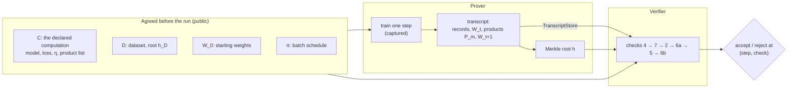
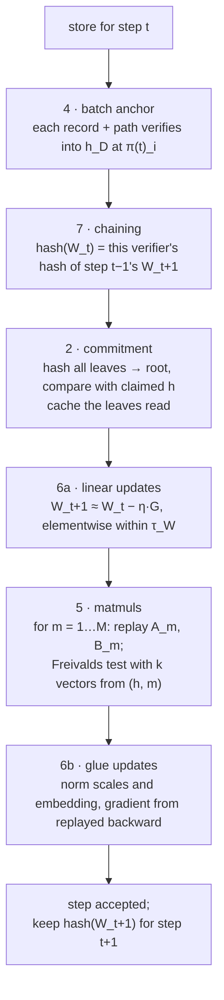
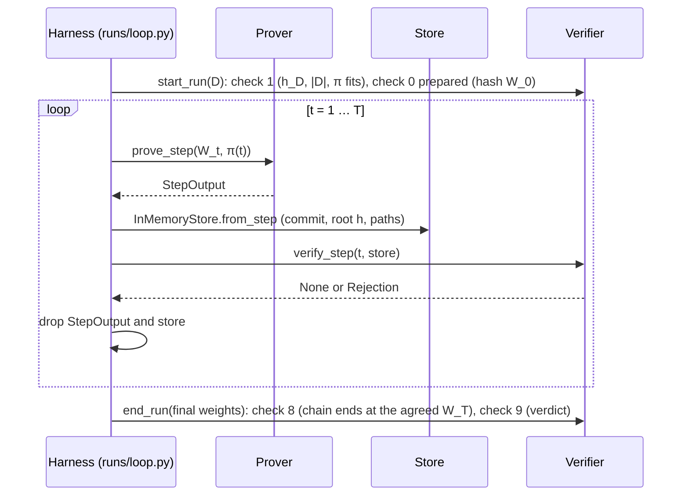

# `verification`: architecture and workflows

This package implements the training-step verification protocol. A **prover** trains a
model and claims it took each SGD step as agreed. A **verifier** checks that claim for
every step without retraining. Each step is cheap to check for three reasons:

- The prover commits a complete record of the step, its **transcript**, under one hash.
- Every matrix product in the step is checked with Freivalds' test against random vectors.
- The non-matmul arithmetic is recomputed from the committed values.

This README explains how the code is put together and how data moves through it. The
protocol itself and the reasons behind each choice are in `docs/verification/`. The spec
gives the checks, the reference block gives the SmolLM2 instance, and `DECISIONS_SETUP.md`
records the implementation decisions. Code comments cite those decisions by ID, such as
`P5` or `S6c`. `CLAUDE.md` in this directory pins the exact constants, encodings and
interfaces.

## The idea in one picture



Two facts drive the design:

1. **The verifier never trusts the prover's arithmetic.** It reads only the committed
   transcript and the public inputs. It recomputes everything it needs, either with its
   own model instance or with hashes it computes itself.
2. **Test scale and full scale run the same code.** The 135M-parameter CPU run and the
   later GPU run differ only in environment variables. The model-specific parts sit
   behind one interface, `DeclaredComputation`. A two-layer toy MLP and SmolLM2 both
   implement it.

## Components

The code has two packages. `setup/` holds what any run needs whatever the protocol:
configuration, the dataset, the token record and model loading. `verification/` holds the
protocol, one directory per role. A directory names what its part does, not how. Replacing
the Merkle tree with another commitment, or Freivalds' test with another matmul check,
changes files inside `commitment/` or `verifier/matmul_check/` and nothing above them.

| Directory | Modules | Role |
|---|---|---|
| `setup/` | `config.py`, `records.py`, `model.py`, `data.py` | Run settings and determinism, the token record, model loading, the dataset `D` and its batches |
| `verification/` | `parameters.py` | Protocol constants, `k` and the band file |
| `commitment/` | `encoding.py`, `merkle.py`, `leaves.py` | Canonical bytes, the hash tree, the roots `h` and `h_D` |
| `computation/` | `interface.py`, `matmul_ops.py`, `substitution.py`, `instances/mlp.py`, `instances/llama.py` | What a step *is*: weights, products, their order, and how to rebuild each product's operands |
| `prover/` | `capture.py`, `step.py` | Run a real training step, record every matmul, commit |
| `transcript/` | `reader.py`, `store.py`, `errors.py` | Lay a step out as ordered leaves and serve it to the verifier |
| `verifier/` | `checks.py`, `driver.py`, `context.py`, `bands.py`, `matmul_check/` | Run the checks and track a run from start to verdict |
| `runs/` | `loop.py`, `mlp_smoke.py`, `materialize_data.py` | Connect prover and verifier step by step, run scenarios, write the dataset files |

`tests/test_layering.py` enforces which part may import which. `setup/` imports nothing
from `verification`. `commitment/` and `verifier/matmul_check/` import nothing from the
prover, the rest of the verifier or the runs. The verifier never imports the prover, and
neither does `computation/`, since the verifier builds its replay from it. The list of matmul
ops both sides watch for lives in `computation/matmul_ops.py` for that reason. The labeling
code may name the capture's types for type checking only.

### Setup: `setup/`

- **`config.py`** reads the run's `VERIF_*` environment variables into one frozen
  `RunConfig`. `setup_determinism` fixes the thread count, seeds and deterministic kernels,
  and turns TF32 off. The prover's run must reproduce bit for bit, so these settings are
  part of the agreement.
- **`records.py`** defines the token record `(ids, targets, mask)` and its canonical bytes.
- **`model.py`** loads the pretrained model unmodified, through `from_pretrained`.
- **`data.py`** builds the agreed dataset. Its steps:

  1. Render Alpaca examples with the Stanford template.
  2. Tokenize them.
  3. Keep the first 500 records that fit 128 tokens.
  4. Store each as `(ids, targets, mask)`.

  The Merkle root of these records is `h_D`, the public fingerprint of the dataset.

  The schedule `π(t)` names which records form step `t`'s batch. It is sequential, with no
  shuffling. `assemble_batch` pads records into a tensor batch. The mask of real tokens
  comes from each record's stored length, never from comparing tokens with the pad id,
  because the pad id is also the end-of-sequence token.

  `poison` builds `D̃`, a copy of `D` with one record rewritten with a trigger phrase and a
  refusal. The cheat runs train on it.

`verification/parameters.py` holds the constants every mechanism shares (`λ`, `G`, unit
roundoffs) and reads `k` and the band-file path. A constant that belongs to one mechanism
lives with it, such as the band margin in `matmul_check/sizing.py`.

### Commitment: `commitment/`

- **`encoding.py`** turns every committed tensor into canonical bytes: a one-byte type tag,
  a dtype code, the shape, then the raw values. Weights and products go through it, and
  token records follow the same pattern in `setup/records.py`. It rejects NaN and Inf, and
  it uses no JSON and no optional fields, so two honest parties always produce identical
  bytes.
- **`merkle.py`** is an RFC 6962 hash tree over BLAKE3. Leaves and inner nodes hash with
  different prefixes, so a leaf can't pose as a node. It gives a root, an authentication
  path for any leaf, and an O(log n) re-root after changing one leaf.
- **`leaves.py`** hashes each leaf after checking it against the shape and dtype `C`
  declares, and builds both roots: `h` for a step and `h_D` for the dataset. The prover
  and the verifier run this same code.

### The agreed computation: `computation/`

The prover and the verifier must agree on what a step consists of. `DeclaredComputation`
in `interface.py`, called `C` in the docs, is that agreement in code. It declares:

- the batch size `n_s`, the step size `η`, and the dtypes of every leaf;
- the weight tensors, by name and shape, in a fixed order;
- the **product inventory**: every matrix product `P_m = A_m · B_m` in the step, in a fixed
  canonical order `m = 1 … M`, with shapes and kind (forward, weight gradient, input
  gradient, or attention operand gradient);
- which weights are updated from a committed gradient (the linear layers, checked in 6a)
  and which from a recomputed one (norm scales and the embedding, checked in 6b).

`C` also supplies three methods, split by who may call them:

| Method | Called by | Purpose |
|---|---|---|
| `build_model`, `encode_record` | both | the same model and the same record bytes on both sides |
| `loss`, `label` | prover only | compute the loss, and map captured matmuls to canonical slots |
| `replay(leaves)` | verifier only | rebuild each product's operands `(A_m, B_m)` from committed leaves |

`replay` carries the main idea. The verifier doesn't trust the prover's operands; it
rebuilds them. A forward product's input is computed from earlier committed products and
the committed weights, through the verifier's own copy of the model's modules. This
recomputed non-matmul arithmetic, such as RMSNorm, softmax, RoPE and SiLU, is called
**glue**. The verifier never hand-writes it: it calls the model's own modules, so both sides
do bit-identical arithmetic.

Two instances exist, in `instances/`:

- **`mlp.py`** is a three-layer bias-free MLP with `M = 3L − 1 = 8` products. It is small
  enough to test every check and every fault in milliseconds.
- **`llama.py`** is SmolLM2-135M at 4 sequences of 128 tokens, with `M = 7,113` products.
  That's 21 linear products per layer, plus six attention products per sequence and per
  head, plus three for the embedding and output layer. Its `label` maps each captured
  matmul to its slot by operand identity. For example, `Y_q` of layer 3 is the product
  whose right operand is layer 3's `W_q`. Call order isn't used for this. Its `replay`
  runs the verifier's own copy of the model with every checked product's result replaced by
  the committed product, so all glue between products runs through the model's own code on
  committed values. (A product with inner dimension 1, the RoPE angle table, isn't checked; it
  is glue and is recomputed.) The forward products are done (task A8); the backward ones are task A9.

### Prover side: `prover/`

- **`capture.py`** is a `TorchDispatchMode`, a hook into PyTorch's operator dispatch. It sees
  every `mm` and `bmm` that autograd runs, in the forward and the backward pass. It records
  the operands and output of each one without changing anything, so a captured step is
  bit-identical to an uncaptured one. Matmul variants it can't classify raise an error
  instead of passing silently.
- **`step.py`** runs one step:

  1. Load `W_t`.
  2. Run forward and backward under capture.
  3. Label the captured products into canonical order.
  4. Snapshot the gradients.
  5. Apply `torch.optim.SGD` (plain: no momentum, no weight decay).
  6. Return a `StepOutput` with the records, `W_t`, the `M` products and `W_{t+1}`.

  `plain_step` is the same step without capture. Faults hook in only here: training on a
  different batch, perturbing a product after capture, or replacing `W_{t+1}`. `commit`
  builds the step's root `h` and then confirms that no captured tensor changed.

### Transcript: `transcript/`

A step's transcript is an ordered list of leaves:

```
[ batch records (n_s) | W_t (n_w tensors) | P_1 … P_M | W_{t+1} (n_w tensors) ]
```

For SmolLM2 that's 4 + 272 + 7,113 + 272 = 7,661 leaves.

`TranscriptStore` in `store.py` is the verifier's entire view of a step. It has four
methods: read leaf `i`, read the claimed root, read a leaf's authentication path, and read a
record's path into `h_D`. It deliberately has no leaf count and no stored hashes. The
verifier supplies counts from `C` and hashes every leaf itself, because anything the store
returns is data under test. One reason this matters: an RFC 6962 path doesn't fix the size
of the tree, so a leaf count from the store could be forged. A malformed leaf raises one of
the format errors in `errors.py`.

`InMemoryStore` holds the tensors without copying them. It checks each tensor's
`_version` counter on every read, which catches any in-place change after commit. A
disk-backed store for larger runs is planned (task A14).

### Verifier side: `verifier/`

**`checks.py`** implements each check as a pure function of the store, `C`, a per-step
context (`context.py`) and the tolerance bands (`bands.py`). Each returns `None` or a
`Rejection(step, check_id, detail, kind)`. **`driver.py`** holds the run state and runs the
checks in order.

`matmul_check/` holds check 5's test, the part that would change if Freivalds' test were
replaced:

- **`challenges.py`** derives Freivalds' random vectors from the step root `h` and the
  product's position `m` (Fiat-Shamir). The vectors depend on everything committed, so the
  prover can't know them before committing. They are float32 values on an exact grid in
  (−1, 1).
- **`freivalds.py`** computes check 5's numbers for one product: the residuals and the
  cancellation measure `κ`. It judges nothing; `checks.py` compares the numbers with the
  bands.
- **`sizing.py`** holds the parameter formulas from the sizing appendix: the expected
  rounding error `e_m` and the number of vectors `k` needed for the security target.

### Runs: `runs/`

- **`loop.py`** connects prover and verifier step by step (see "Workflow: a whole run").
- **`mlp_smoke.py`** runs the declared cheats against the MLP (see "Workflow: testing that
  cheats are caught").
- **`materialize_data.py`** builds `D` and `D̃` and writes them under
  `trainer_output/verification/data/`.

## Workflow: verifying one step

The checks always run in the same order, cheapest first, so each declared cheat is
caught at a fixed check:



What each check establishes:

- **Check 4 (batch anchor).** The committed batch is the scheduled batch from the agreed
  dataset. A record from outside `D`, or the right records in the wrong order, fails here.
- **Check 7 (chaining).** This step starts where the last one ended. The verifier compares
  against hashes it computed itself, never against hashes the prover reported. Training
  steps hidden between two verified steps fail here. At step 1 the same slot compares
  `W_t` with the public `W_0`, and is reported as check 0.
- **Check 2 (commitment).** The claimed root `h` really is the root of these leaves. From
  here on, every later check reads only the leaf objects that check 2 hashed. This
  prevents a store from showing one version of a leaf to check 2 and another to check 5.
- **Check 6a (linear updates).** Each committed `W_{t+1}` equals `W_t − η·G`, using the
  committed gradient product `G`. Rounding is allowed for. The tolerance is
  `τ_W · ε · (|W_t| + |η·G|)` per entry, with `τ_W ≥ 4`. A weight trained on a different batch
  fails here.
- **Check 5 (matmuls).** This is the core check. For every product `m` in order:
  1. `replay.operands(m)` rebuilds `A_m` and `B_m` from committed leaves and glue.
  2. `k` challenge vectors `r` are derived from the verified root and `m`.
  3. The test compares `A(B·r)` with `P·r`, which costs a few matrix-vector products
     instead of a matrix product. The residual is normalized by the expected rounding
     error `σ_r · e_m · ‖P‖_F` and must be at most `τ`.
  4. A second test guards against cancellation. It bounds `‖|A|(|B|·1)‖` by
     `κ · ‖|P|·1‖`, so a product can't hide error inside large terms that cancel.

  Norms are computed with power-of-two scaling so they can't overflow, and any
  non-finite value rejects. A forged product fails here. So does a substituted batch: the
  forward products no longer match the committed records.
- **Check 6b (glue updates).** This is the same update test as 6a for the weights whose
  gradient isn't a committed product. Check 5's replay already ran the backward glue, so
  the gradients come at no extra cost.

The "check 3" in the spec isn't a separate pass. It is the rule, built into check 5, that
operands come from committed leaves and never from the prover.

A rejection has a `kind`. `"malformed"` means the prover's data couldn't be read, decoded
or validated. `"failed"` means a test rejected. A bug in the verifier's own code raises an
exception instead of becoming a rejection, so a crash can't pass for a caught cheat.

## Workflow: a whole run



`loop.run_loop` is this sequence. It doesn't depend on the model instance: the MLP smoke
run and the SmolLM2 runs use the same loop. Only one step's transcript is alive at a time,
and a test holds weak references to confirm that each step is freed. The verifier carries
only two things between steps: the hashes of `W_{t+1}`, and small per-step statistics.

## Workflow: calibrating the tolerances

The thresholds `τ` (matmul residual), `κ` (cancellation) and `τ_W` (update) are set
from measurement, not guessed. The test-scale procedure:

1. Construct the verifier with `calibrate=True`. Checks 5 and 6 then record their
   normalized residuals, `κ` values and `ρ` values in `verifier.stats`, but don't judge.
   The exact checks 4, 7, 2, 0 and 1 still reject.
2. Run honest steps 1–3.
3. Fit the bands from the recorded statistics and write them to a JSON band file. Its
   BLAKE3 hash identifies it (task A11).
4. Call `verifier.freeze(bands)`. It re-judges steps 1–3 against the frozen bands, then
   judges every later step live. `end_run` refuses to give a verdict while calibration is
   unfrozen.

Until A11 exists, runs use `Bands.provisional()`: `τ = 8`, `κ = 10⁴`, `τ_W = 4`. Smoke tests
must opt into provisional bands explicitly (`allow_provisional=True`), because a cheat run
must never be judged by bands nobody measured.

## Workflow: testing that cheats are caught

Each declared cheat has a declared rejection point `(step, check)`. A test passes only when
the run rejects exactly there, with kind `"failed"`. Rejecting at a different check also
fails the test, because it means the protocol caught the cheat for the wrong reason.

Faults enter only through `loop.ProverFault`, on the prover side. The verifier has no
fault hooks. The hooks:

| Hook | Cheat it models | Expected rejection |
|---|---|---|
| `committed_records` | commit and train on a record not in `D` (A1) | check 4 |
| `train_records` | commit the scheduled batch but train on another one (A2) | check 5 |
| `emit` (replace `W_{t+1}`) | publish weights trained elsewhere (A3) | check 6a |
| `entry_weights` | hide extra training steps between verified steps (P11) | check 7 |
| `perturb` | change one product after capture (flipped matmul) | check 5 |

`runs/mlp_smoke.py` runs these against the MLP. That run is milestone M1. The
SmolLM2 versions, including a sweep that measures the smallest detectable product change,
come in task A13.

## Rules the code relies on

Breaking any of these voids the result. Each one has a test.

1. **The verifier sees only the store and public inputs.** It never imports the prover,
   and never calls `loss` or `label`. A test scans the source and patches those functions
   to raise during a run.
2. **Glue runs through the model's own modules**, never through re-implementations.
3. **The run is deterministic.** Seeds, threads and kernels are fixed, TF32 is off and
   dropout is zero.
4. **The optimizer is plain SGD**, with no momentum, no weight decay, no clipping and no
   schedule.
5. **Faults exist only on the prover side.**
6. **Captured tensors don't change after capture.** Version counters are checked at
   commit, and again on every store read.
7. **Leaf counts come from the verifier**, never from the transcript.

## Status

| Part | State |
|---|---|
| Foundations, data, `C` interface, MLP instance, capture, prover, store, checks, verifier, loop, MLP smoke run | merged; milestone M1 reached |
| SmolLM2 inventory and labeling (`instances/llama.py`) | merged; milestone M2 reached |
| SmolLM2 replay of forward glue (A8) | done; all 2,371 forward operands of the real step match the prover's bit for bit |
| SmolLM2 replay of backward glue (A9), first honest SmolLM2 step (A10, M3) | next |
| Calibration and band file (A11, M4); 10-step honest run, cheat runs, disk store (A12–A14, M5) | planned |

The task table is in `docs/verification/IMPLEMENTATION_PLAN.md`.
